# Memoriaali v2

> **Digital Archive Reception Platform** - Finnish memory institution service with monorepo architecture

Memoriaali v2 is a platform for receiving archival materials for Finnish memory institutions.

### What Has Been Achieved

✅ **Architecture**: Monorepo implementation with TypeScript, React, and Java services  
✅ **Backend**: Express.js API with comprehensive authentication, authorization, and business logic  
✅ **Frontend**: Next.js 15 application with React 19 and internationalization  
✅ **Database**: Prisma schema with relationships and type safety  
✅ **SIP Service**: Java-based E-ARK compliant archival package generation  
✅ **Testing**: Unit, integration, and E2E testing infrastructure

## What Memoriaali v2 Provides

### Core Capabilities

- **Digital Submission Pipeline**: Multi-format support for documents, images, audio, and video
- **Type Safety**: End-to-end TypeScript with Prisma → Zod → TypeScript pipeline
- **Security**: JWT authentication, role-based authorization, field-level security
- **Testing**: Unit, integration, and E2E testing

### Expansions

- **Archiving**: E-ARK compliant SIP package generation with Java service
- **Memory Institution Features**: Oral history recording
- **Automatic Metadata detection**: Automatic metadata detection using Arkkiivi components (https://arkkiivi.fi)
- **Automatic scanning error detection**: Automatic scanning error detection using Arkkiivi components (https://arkkiivi.fi)

### Production Architecture

The system implements a monorepo:

```mermaid
graph TB
    subgraph "Production V2 Architecture"
        A1["Backend<br/>Express.js + TypeScript<br/>Authentication & Authorization<br/>File Processing<br/>OpenAPI Documentation"]
        A2["Frontend<br/>Next.js 15 + React 19<br/>Internationalization<br/>API client<br/>Responsive design"]
        A3["SIP Service<br/>Java Spring Boot<br/>E-ARK compliance<br/>Batch processing<br/>Queue management"]
        A4["Database Package<br/>Prisma schema<br/>MySQL integration<br/>Type generation"]
        A5["API Types Package<br/>Zod validation<br/>TypeScript contracts<br/>Shared schemas<br/>Auto-generation"]
        A6["Shared Package<br/>Common utilities<br/>Constants<br/>Pagination<br/>Validation helpers"]
    end

    subgraph "Development Infrastructure"
        B1["ESLint Config<br/>Code quality rules<br/>Security linting<br/>TypeScript rules"]
        B2["Prettier Config<br/>Code formatting<br/>Consistent style<br/>Auto-formatting"]
        B3["Vitest Config<br/>Testing framework<br/>Coverage reporting<br/>Mock utilities"]
    end
    A1 --> A4
    A1 --> A5
    A2 --> A5
    A4 --> A5
    A3 --> A4

    style A1 fill:#00471B
    style A2 fill:#00471B
    style A3 fill:#00471B
    style A4 fill:#00471B
    style A5 fill:#00471B
    style A6 fill:#00471B
```



#### Detailed architecture documentation

You can find more detailed architecture documentation from **[📋 this architecture readme](docs/architecture/README.md)**.

## How to Get Started with V2

### Prerequisites Understanding

Memoriaali v2 requires Node.js, pnpm, and Docker for the complete development environment.

### Environment Setup

The following diagram shows the complete setup and verification process:

```mermaid
flowchart TD
    A["Prerequisites Check"] --> B["Install Tools"]
    B --> C["Clone & Setup Project"]
    C --> D["Database Configuration"]
    D --> E["Verification"]
    E --> F["Start Production System"]

    B1["Node.js 22.18.x+<br/>pnpm 8+<br/>Docker required<br/>Java 21+"]
    C1["git clone<br/>pnpm install<br/>.env setup"]
    D1["Docker MySQL<br/>Prisma schema push"]
    E1["pnpm dev<br/>All services running<br/>Full system verification"]
    F1["Ready V2 system"]

    B --> B1
    C --> C1
    D --> D1
    E --> E1
    F --> F1

    style A fill:#00471B
    style F fill:#ccffcc, color: #000
```



#### Quick Setup (15-30 minutes)

```bash
# 1. Clone and install dependencies
git clone <repository>
cd Memoriaali
cp .env.example .env # There are multiple .env.example files
pnpm install
pnpm build

# The backend needs to be up when running api:gen
cd apps/backend
pnpm dev

# Different terminal
cd apps/frontend
pnpm api:gen

# 2. Start Docker services
docker compose up -d

# 3. Setup database
pnpm --filter database db:push

# 4. Start all services
pnpm dev

# 5. Verify production system
curl http://localhost:3001/api/v2/health    # Backend health check
# Visit http://localhost:3000              # Frontend application
# Visit http://localhost:3001/api/v2/docs  # API documentation
```

#### Complete Setup

For comprehensive environment setup including Docker, Java runtime, and all services, follow the **[📋 Complete Setup Guide](docs/development/setup.md)**.

### Development Workflow

#### Primary Development Commands

```bash
# Development workflow
pnpm dev                 # Start all services
pnpm test               # Run comprehensive test suites
pnpm lint:quality       # Code quality checks
pnpm build              # Build all packages

# Individual service development
pnpm --filter backend dev       # Backend API service
pnpm --filter frontend dev      # Frontend application
pnpm --filter database db:seed  # Database seeding
pnpm --filter sip-service dev   # SIP generation service

# Quality gates
pnpm quality-gates      # Complete quality pipeline
```

#### Quality Gates & Testing

```bash
# Comprehensive quality gates (all quality checks)
pnpm run quality-gates  # format + lint + type-check + test (unit + E2E)

# Individual quality components
pnpm run test           # Unit tests + E2E conditional
pnpm run lint           # Code quality checks
pnpm run type-check     # TypeScript validation
pnpm run build          # Build verification

# E2E Testing (Local Development Only)
# E2E tests are designed for local development with Docker
# CI/CD skips E2E tests for faster pipeline execution
cd apps/backend/e2e && docker compose up -d && npm run test  # Backend E2E
cd apps/frontend/e2e && docker compose up -d && npm run test # Frontend E2E

# Test coverage and detailed reports
pnpm run test:coverage           # Test coverage reports
pnpm run test:watch             # Watch mode for unit tests
```

## Technology Stack

### Implemented Technologies

**Backend Foundation**:

- **TypeScript**: Type safety with configuration
- **Express.js**: RESTful API with middleware pipeline
- **Prisma ORM**: Type-safe database access
- **MySQL**: Database with indexing
- **JWT Authentication**: Secure token-based authentication
- **Zod Validation**: Runtime schema validation
- **Winston Logging**: Structured logging with correlation IDs

**Frontend Foundation**:

- **Next.js 15**: App Router with Server Components
- **React 19**: React features and concurrent rendering
- **TypeScript**: End-to-end type safety
- **next-intl**: Internationalization (Finnish, English)
- **Bootstrap + Sass**: Responsive design system
- **Generated API Client**: Type-safe API integration

**SIP Service**:

- **Java 21**: Java runtime
- **Spring Boot**: Microservice framework
- **E-ARK Libraries**: Archival compliance
- **Queue Management**: Background job processing
- **Batch Processing**: Large-scale archival operations

**Monorepo Infrastructure**:

- **Turborepo**: Build orchestration and caching
- **pnpm Workspaces**: Efficient dependency management
- **Vitest**: Fast testing framework with coverage
- **ESLint + Prettier**: Code quality and formatting
- **Docker**: Containerized development environment

### How Technologies Work Together

```mermaid
graph TB
    subgraph "Type Safety Flow"
        A["Prisma Schema"] --> B["Generated Types"]
        B --> C["API Types Package"]
        C --> D["Backend Services"]
        C --> E["Frontend Components"]
    end

    subgraph "Development Flow"
        F["pnpm Workspaces"] --> G["Turborepo"]
        G --> H["Vitest Testing"]
        H --> I["ESLint Quality"]
        I --> J["Production Build"]
    end

    style A fill:#1baced, color: #000
    style J fill:#00471B
```



## Project Structure

### Why This Structure

The monorepo structure provides **clear separation of concerns**, **shared code reuse**, and **consistent development patterns** across all packages.

### What Each Directory Contains

```
MemoriaaliV2/
├── apps/            🚀  V2 Applications
│   ├── backend/         # TypeScript API server
│   ├── frontend/        # Next.js application
│   └── archiver/        # Java archival service
├── packages/        📦  Shared Libraries
│   ├── database/        # Prisma schema & migrations
│   ├── api-types/       # TypeScript API contracts
│   └── shared/          # Common utilities
├── tools/           🔧  Development Configuration
│   ├── eslint-config/   # Code quality rules
│   ├── prettier-config/ # Formatting standards
│   └── vitest-config/   # Testing setup
```

### How to Navigate the Structure

- **Start development** in `apps/` directories
- **Use shared code** from `packages/`
- **Follow conventions** defined in `tools/`

## Quality Gates

### Quality Commands

```bash
# Complete quality pipeline
pnpm quality-gates      # All quality gates: format + lint + type-check + test

# Individual components
pnpm test               # Comprehensive test suite (unit + integration + E2E)
pnpm lint:quality       # Code quality checks
pnpm type-check         # TypeScript validation
pnpm build              # Build verification
```

## Contact & Support

- **Organization**: South-Eastern Finland University of Applied Sciences (XAMK) - Digitalia
- **Email**: memoriaali@xamk.fi
- **Development**: Partnership with Mindhive Oy

---
