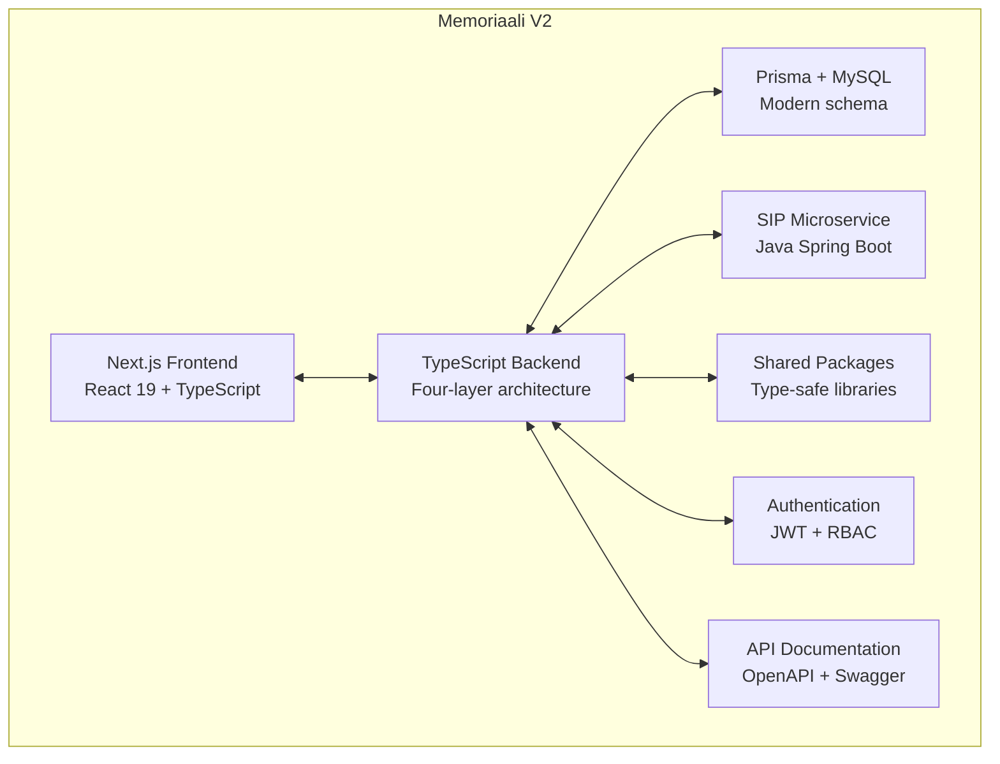
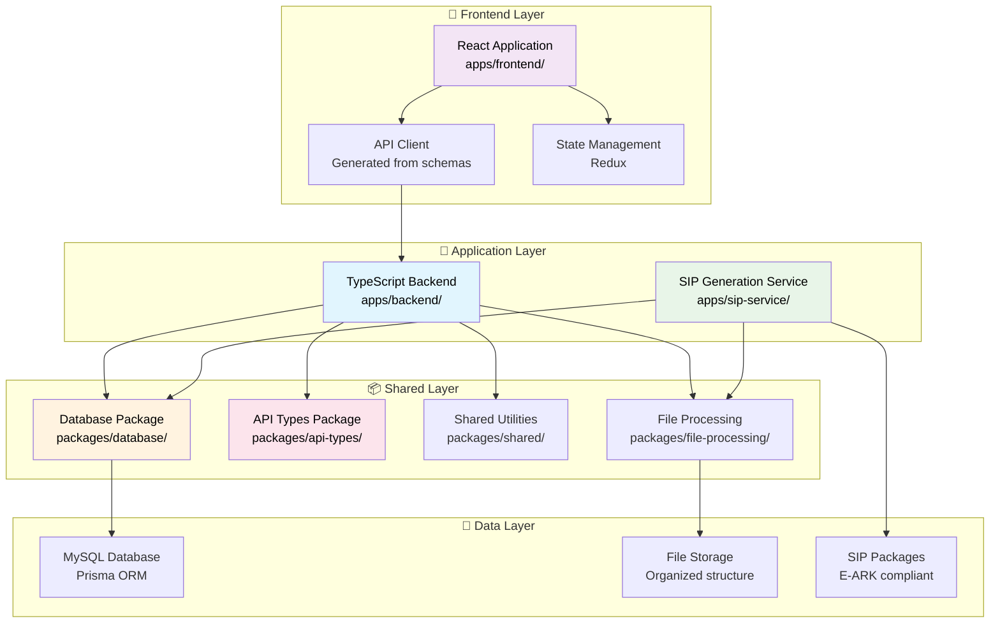
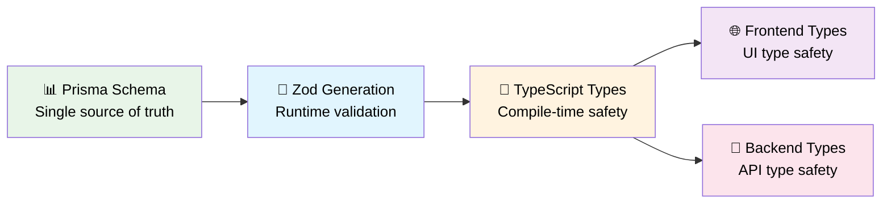
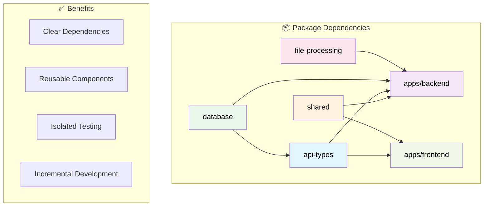
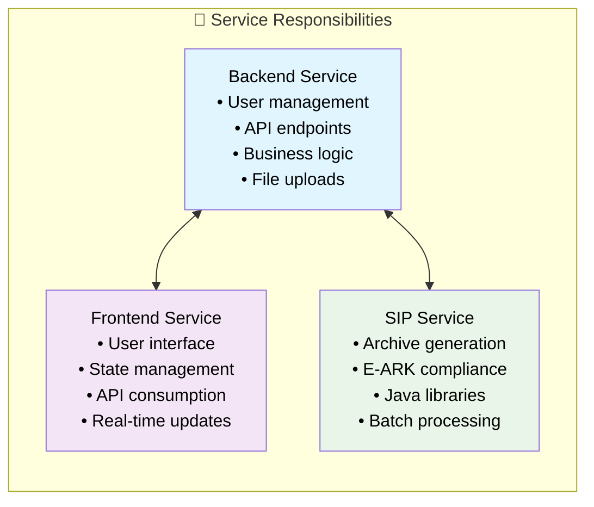
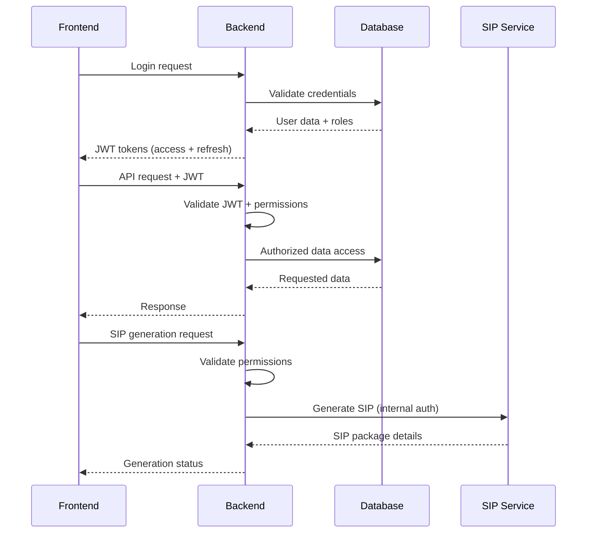

# Architecture Documentation

> **System design and architectural decisions for Memoriaali v2**

## 🎯 Architecture Overview

The Memoriaali v2 project is a scalable monorepo architecture. This section documents the architectural decisions and system design.

## 🏗️ High-Level System Architecture

### System Architecture





## 🔧 Key Architectural Principles

### 1. Type Safety End-to-End



**Benefits**:

- Catch errors at compile time
- Automatic API documentation
- Refactoring safety
- Shared contracts between frontend and backend

### 2. Modular Package Architecture



### 3. Service Separation



**Rationale**:

- **Backend**: Web application logic in TypeScript/Node.js
- **SIP Service**: Specialized archival processing in Java
- **Frontend**: User interface and experience optimization

## 🗄️ Data Architecture Overview

### Schema Approach

```typescript
// Example: Document model with flexible metadata
model Document {
  id                     String         @id @default(cuid())
  title                  String
  filename               String

  // Flexible JSON metadata with proper indexing
  metadata    Json?

  // Proper relationships
  uploadedBy             String
  user                   User           @relation(fields: [uploadedBy], references: [id])
  fileMetadata           FileMetadata?
  collections            CollectionDocument[]

  @@index([title])
  @@fulltext([title])
}
```

## 🔐 Security Architecture

### Authentication & Authorization Flow



**Security Features**:

- JWT-based authentication with refresh tokens
- Role-based access control (RBAC)
- Request validation with Zod schemas
- Secure service-to-service communication
- Audit logging for sensitive operations

## 📚 Architecture Decision Records

### Key Decisions

1. **Monorepo with Turborepo**: Enables shared dependencies and atomic changes
2. **Prisma + Zod Pipeline**: Provides end-to-end type safety from database to frontend
3. **Service Separation**: Java SIP service handles specialized archival processing
4. **Docker Development**: Ensures consistent environments across team

### Future Enhancement Opportunities

- **Caching Strategy**: Redis integration for performance optimization
- **Queue System**: Background job processing for file operations
- **API Gateway**: Centralized routing and rate limiting
- **Monitoring**: Comprehensive observability and alerting
- **Microservices Evolution**: Current monorepo can be split into microservices as needed

---

**Last Updated**: June 2026
